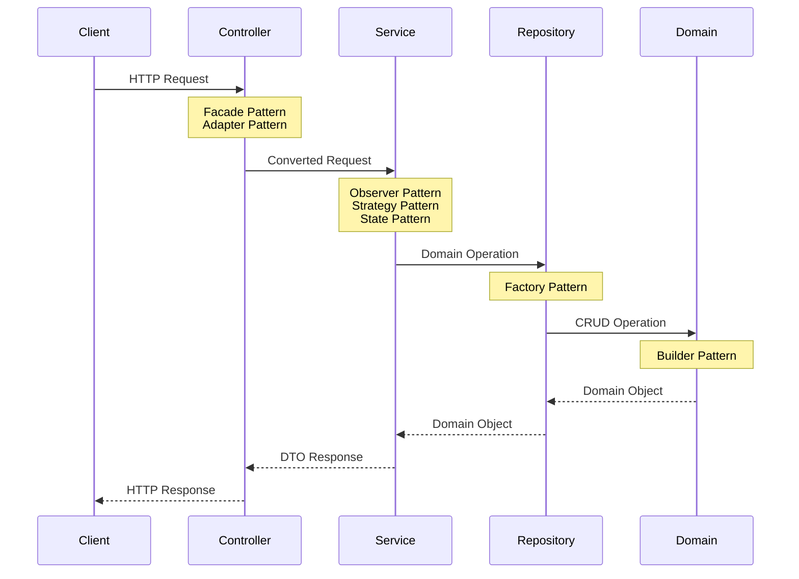

# IoT Energy Monitoring System

## Table of Contents
1. [Project Overview](#project-overview)
2. [System Architecture](#technical-architecture)
3. [Setup and Installation](#setup-and-installation)
4. [Running the Application](#running-the-application)
5. [API Documentation](#api-documentation)
6. [Development Setup](#development-setup)
7. [Testing Strategy](#testing-strategy)
8. [Implementation Phases](#implementation-phases)
9. [Success Metrics](#success-metrics)

## Project Overview
The IoT Energy Monitoring System is a Spring Boot application designed to monitor and analyze energy consumption data from IoT devices. The system demonstrates basic CRUD operations, data analysis capabilities, and a clean architecture following OOP principles.

### Target Audience
- System administrators managing IoT devices
- Energy managers tracking consumption patterns
- Development teams looking to integrate energy monitoring capabilities

## Setup and Installation

### Docker Compose Setup

#### Prerequisites
- Docker
- Docker Compose

#### Steps to Run with Docker

1. Clone the repository:
```bash
git clone https://github.com/your-username/iot-energy-monitoring.git
cd iot-energy-monitoring
```

2. Create a `docker-compose.yml` file in the project root:
```yaml
version: '3.8'
services:
  mysql:
    image: mysql:8.3.4
    environment:
      MYSQL_ROOT_PASSWORD: rootpassword
      MYSQL_DATABASE: iot_monitoring
      MYSQL_USER: iotuser
      MYSQL_PASSWORD: iotpassword
    ports:
      - "3306:3306"
    volumes:
      - mysql-data:/var/lib/mysql

  app:
    build: .
    ports:
      - "8080:8080"
    depends_on:
      - mysql
    environment:
      - SPRING_DATASOURCE_URL=jdbc:mysql://mysql:3306/iot_monitoring
      - SPRING_DATASOURCE_USERNAME=iotuser
      - SPRING_DATASOURCE_PASSWORD=iotpassword

  swagger-ui:
    image: swaggerapi/swagger-ui
    ports:
      - "8081:8080"
    environment:
      - SWAGGER_JSON=/app/swagger.json
    volumes:
      - ./swagger.json:/app/swagger.json

volumes:
  mysql-data:
```

3. Create a `Dockerfile` in the project root:
```dockerfile
FROM maven:3.8.1-openjdk-21-slim AS build
WORKDIR /app
COPY pom.xml .
COPY src ./src
RUN mvn clean package -DskipTests

FROM openjdk:21-slim
WORKDIR /app
COPY --from=build /app/target/*.jar app.jar
EXPOSE 8080
ENTRYPOINT ["java", "-jar", "app.jar"]
```

4. Run the application:
```bash
docker-compose up --build
```

#### Accessing the Application
- Main Application: `http://localhost:8080`
- Swagger UI: `http://localhost:8081`
- MySQL Database: `localhost:3306`

### Manual Setup

#### Prerequisites
- JDK 21
- Maven 3.8
- MySQL 8.3.4

#### Configuration
Update `src/main/resources/application.properties`:
```properties
spring.datasource.url=jdbc:mysql://localhost:3306/iot_monitoring
spring.datasource.username=root
spring.datasource.password=password
spring.jpa.hibernate.ddl-auto=update
```

#### Build and Run
```bash
mvn clean install
mvn spring-boot:run
```

## Technical Architecture

### 1. System Architecture


```
Controller Layer (REST API)
├── Facade Pattern: Simplify API interface
└── Adapter Pattern: Convert external data formats

Service Layer (Business Logic)
├── Observer Pattern: Device state notifications
├── Strategy Pattern: Energy calculations
└── State Pattern: Device state management

Repository Layer (Data Access)
└── Factory Pattern: Create data access objects

Domain Layer (Entity Layer)
└── Buider Pattern: Construct domain objects
```

### 2. Project Structure
```plaintext
iot-energy-monitoring/
├── src/
│   ├── main/
│   │   ├── java/
│   │   │   └── com/
│   │   │       └── example/
│   │   │           └── iot/
│   │   │               ├── IotApplication.java
│   │   │               ├── controller/
│   │   │               │   ├── DeviceController.java
│   │   │               │   └── EnergyDataController.java
│   │   │               ├── dto/
│   │   │               │   ├── DeviceRegistrationRequest.java
│   │   │               │   └── DeviceResponse.java
│   │   │               ├── exception/
│   │   │               │   ├── DeviceNotFoundException.java
│   │   │               │   └── DuplicateDeviceException.java
│   │   │               ├── model/
│   │   │               │   ├── Device.java
│   │   │               │   ├── DeviceStatus.java
│   │   │               │   └── EnergyData.java
│   │   │               ├── repository/
│   │   │               │   ├── DeviceRepository.java
│   │   │               │   └── EnergyDataRepository.java
│   │   │               └── service/
│   │   │                   ├── DeviceService.java
│   │   │                   └── EnergyDataService.java
│   │   └── resources/
│   │       ├── application.properties
│   │       ├── static/
│   │       │   ├── css/
│   │       │   │   └── styles.css
│   │       │   ├── index.html
│   │       │   └── js/
│   │       │       ├── api.js
│   │       │       └── app.js
│   └── test/
│       └── java/
│           └── com/
│               └── example/
│                   └── iot/
│                       ├── database/
│                       │   └── DatabaseConnectionTest.java
│                       ├── unit/
│                       │   ├── controller/
│                       │   │   ├── DeviceControllerTest.java
│                       │   │   └── EnergyDataControllerTest.java
│                       │   ├── dto/
│                       │   │   └── DeviceRegistrationRequestTest.java
│                       │   ├── model/
│                       │   │   ├── DeviceTest.java
│                       │   │   └── EnergyDataTest.java
│                       │   ├── repository/
│                       │   │   ├── DeviceRepositoryTest.java
│                       │   │   └── EnergyDataRepositoryTest.java
│                       │   └── service/
│                       │       ├── DeviceServiceTest.java
│                       │       └── EnergyDataServiceTest.java
│       └── resources/
│           └── application-test.properties
└── target/
    └── site/
        └── apidocs/
            └── index.html
```

### 3. Core Components

#### 1. Models (Domain Layer)
The domain model represents the core business entities:

**1.1 Device**
- Core entity representing an IoT device
- Contains essential device information:
    - Unique serial number
    - Device type
    - Current status (Active/Inactive/Maintenance)
    - Last report time
    - Latest energy reading

**1.2 DeviceStatus**

- Enumeration of possible device states
- States: `ACTIVE`, `INACTIVE`, `MAINTENANCE`
- Used to track device operational status

**1.3 EnergyData**

- Represents energy consumption readings
- Links to associated device
- Stores:
    - Energy consumption value
    - Timestamp of reading
    - Relationship to device


#### 2. DTOs (Controller Layer)
Data Transfer Objects for API communication:

**2.1 DeviceRegistrationRequest**
- Used for new device registration
- Contains minimal required information:
    - Serial number
    - Device type


**2.2 DeviceResponse**
- Represents device information in API responses
- Contains complete device details for client use
- Maps from domain Device model

#### 3. Repositories (Repository Layer)
Data access interfaces managing database operations:

**3.1 DeviceRepository**
- Handles device data persistence
- Key operations:
    - Find device by serial number
    - Check device existence
    - Retrieve devices by status

**3.2 EnergyDataRepository**
- Manages energy reading data
- Key operations:
    - Store new readings
    - Retrieve readings by time range
    - Find readings for specific device

#### 4. Services (Service Layer)
Business logic implementation

**4.1 DeviceService**
- Manages device lifecycle
- Key responsibilities:
    - Device registration
    - Status updates
    - Device information retrieval
    - Observer notification for device events

**4.2 EnergyReadingService**
- Handles energy consumption data
- Key responsibilities:
    - Record new readings
    - Calculate energy consumption
    - Update device last reading
    - Manage reading history


#### 5. Controllers (Controller Layer)
API endpoints for external interaction:

**5.1 DeviceController**
- Handles device-related HTTP requests
- Endpoints for:
    - Device registration
    - Device status updates
    - Device information retrieval

**5.2 ReadingController**
- Manages energy reading submissions
- Endpoints for:
    - Submit new readings
    - Retrieve reading history
    - Get device statistics


### Design Patterns Used


1. **Controller Layer**:
    - Use Facade for API endpoints
    - Use Adapter for data conversion

2. **Service Layer**:
    - Use Observer for notifications
    - Use Strategy for varying calculations
    - Use State for device status management

3. **Repository Layer**:
    - Suppose to use Factory for repository creation; however since there are only one database in my current application, using Factory in this case is an over-engineering.

4. **Domain Layer**:
    - For simple data object, no need to use design pattern here


## API Design

### 1. Device Management
```plaintext
POST /api/devices
- Register new device
- Request: DeviceRegistrationRequest
- Response: DeviceResponse

GET /api/devices
- List all devices
- Response: List<DeviceResponse>

GET /api/devices/{id}
- Get device details
- Response: DeviceResponse

PUT /api/devices/{id}
- Update device
- Request: DeviceUpdateRequest
- Response: DeviceResponse

DELETE /api/devices/{id}
- Remove device
- Response: 204 No Content
```

### 2. Energy Data Management
```plaintext
POST /api/devices/{id}/readings
- Record energy reading
- Request: EnergyReadingRequest
- Response: EnergyReadingResponse

GET /api/devices/{id}/readings
- Get device readings
- Query params: startDate, endDate
- Response: List<EnergyReadingResponse>
```

## Database Schema

### Tables
```sql
CREATE TABLE devices (
    id BIGINT PRIMARY KEY AUTO_INCREMENT,
    serial_number VARCHAR(255) UNIQUE NOT NULL,
    device_type VARCHAR(50) NOT NULL,
    status VARCHAR(20) NOT NULL,
    last_report_time DATETIME,
    last_energy_reading DOUBLE
);

CREATE TABLE energy_data (
    id BIGINT PRIMARY KEY AUTO_INCREMENT,
    device_id BIGINT NOT NULL,
    energy_consumed DOUBLE NOT NULL,
    timestamp DATETIME NOT NULL,
    FOREIGN KEY (device_id) REFERENCES devices(id)
);
```

## Testing Strategy

### 1. Unit Tests
- Service layer tests
- Repository layer tests
- Controller layer tests

### 2. Integration Tests
- API endpoint tests
- Database integration tests

### 3. Test Categories
```plaintext
1. Device Registration Tests
2. Energy Data Recording Tests
3. Data Retrieval Tests
4. Error Handling Tests
5. Validation Tests
```

## Implementation Phases

### Phase 1 (Current Prototype)
- [x] Basic project setup (Database)
- [x] Core models and DTOs
- [x] Repository layer
- [x] Basic service layer
- [x] Initial controller endpoints
- [x] Unit tests setup

### Phase 2 (Future)
- [ ] Advanced data analysis
- [ ] Batch processing
- [ ] Extended API features
- [ ] Security implementation
- [ ] Integration tests
- [ ] Performance optimizations
- [ ] Additional analytics
- [ ] Reporting features
- [ ] User interface


## Running the Application

### Prerequisites
- JDK 21
- Maven 3.8
- MySQL 8.3.4

### Configuration
```properties
spring.datasource.url=jdbc:mysql://localhost:3306/iot_monitoring
spring.datasource.username=root
spring.datasource.password=password
spring.jpa.hibernate.ddl-auto=update
```

### Build and Run
```bash
mvn clean install
mvn spring-boot:run
```

## Success Metrics
1. **Technical Metrics**
    - 80%+ test coverage
    - <100ms API response time
    - Zero critical bugs

2. **Functional Metrics**
    - Successful device registration
    - Accurate data recording
    - Proper error handling