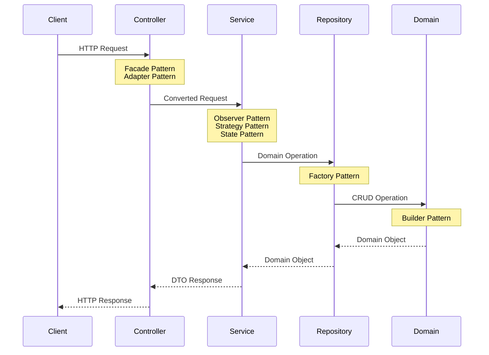

# IoT Energy Monitoring System - Design Document

**Please view web version in [here](https://hackmd.io/@WesleyLeeNTU/HJRtBIcgJe).**
## Project Overview
The IoT Energy Monitoring System is a Spring Boot application designed to monitor and analyze energy consumption data from IoT devices. The system demonstrates basic CRUD operations, data analysis capabilities, and a clean architecture following OOP principles.

### Target Audience
- System administrators managing IoT devices
- Energy managers tracking consumption patterns
- Development teams looking to integrate energy monitoring capabilities


### API Documentation

### 1. Device Management

#### Register Device
- **POST** `/api/devices`
- **Request Body:**
  ```json
  {
    "serialNumber": "DEV-2024-001",
    "deviceType": "SMART_METER"
  }
  ```
- **Response:** (201 Created)
  ```json
  {
    "id": 1,
    "serialNumber": "DEV-2024-001",
    "deviceType": "SMART_METER",
    "status": "ACTIVE",
    "lastReportTime": "2024-03-20T10:30:00",
    "lastEnergyReading": null
  }
  ```

#### Get Device
- **GET** `/api/devices/{id}`
- **Response:** (200 OK)
  ```json
  {
    "id": 1,
    "serialNumber": "DEV-2024-001",
    "deviceType": "SMART_METER",
    "status": "ACTIVE",
    "lastReportTime": "2024-03-20T10:30:00",
    "lastEnergyReading": 120.5
  }
  ```

#### List All Devices
- **GET** `/api/devices`
- **Response:** (200 OK)
  ```json
  [
    {
      "id": 1,
      "serialNumber": "DEV-2024-001",
      "deviceType": "SMART_METER",
      "status": "ACTIVE",
      "lastReportTime": "2024-03-20T10:30:00",
      "lastEnergyReading": 120.5
    }
  ]
  ```

#### Update Device
- **PUT** `/api/devices/{id}`
- **Request Body:**
  ```json
  {
    "deviceType": "SMART_METER_V2",
    "serialNumber": "DEV-2024-001-UPDATED"
  }
  ```
- **Response:** (200 OK)
  ```json
  {
    "id": 1,
    "serialNumber": "DEV-2024-001-UPDATED",
    "deviceType": "SMART_METER_V2",
    "status": "ACTIVE",
    "lastReportTime": "2024-03-20T10:30:00",
    "lastEnergyReading": 120.5
  }
  ```


#### Update Device Status
- **PUT** `/api/devices/{id}/status`
- **Request Body:**
  ```json
  {
    "status": "MAINTENANCE"
  }
  ```
- **Response:** (200 OK)
  ```json
  {
    "id": 1,
    "serialNumber": "DEV-2024-001",
    "deviceType": "SMART_METER",
    "status": "MAINTENANCE",
    "lastReportTime": "2024-03-20T12:00:00",
    "lastEnergyReading": 120.5
  }
  ```


#### Delete Device
- **DELETE** `/api/devices/{id}`
- **Response:** (204 No Content)

### 2. Energy Data Management

#### Record Energy Reading
- **POST** `/api/devices/{id}/readings`
- **Request Body:**
  ```json
  {
    "value": 120.5
  }
  ```
- **Response:** (200 OK)
  ```json
  {
    "id": 1,
    "deviceId": 1,
    "deviceSerialNumber": "DEV-2024-001",
    "value": 120.5,
    "timestamp": "2024-03-20T12:05:00"
  }
  ```


#### Get Device Readings
- **GET** `/api/devices/{id}/readings`
- **Query Parameters:**
  - startDate: `2024-03-20T00:00:00`
  - endDate: `2024-03-20T23:59:59`
- **Response:** (200 OK)
  ```json
  [
    {
      "id": 1,
      "deviceId": 1,
      "deviceSerialNumber": "DEV-2024-001",
      "value": 120.5,
      "timestamp": "2024-03-20T10:30:00"
    }
  ]
  ```


#### Get Latest Reading
- **GET** `/api/devices/{id}/readings/latest`
- **Response:** (200 OK)
  ```json
  {
    "id": 2,
    "deviceId": 1,
    "deviceSerialNumber": "DEV-2024-001",
    "value": 125.8,
    "timestamp": "2024-03-20T11:30:00"
  }
  ```

#### Get Average Consumption
- **GET** `/api/devices/{id}/readings/average`
- **Response:** (200 OK)
  ```json
  123.15
  ```

### Error Responses

#### Not Found (404)

```json
{
"timestamp": "2024-03-20T12:00:00",
"status": 404,
  "error": "Not Found",
  "message": "Device not found with ID: 1"
}
```

#### Bad Request (400)
```json
{
"timestamp": "2024-03-20T12:00:00",
"status": 400,
"error": "Bad Request",
"message": "Serial number is required"
}
```

## Testing Strategy

## Test Coverage
- **Model Layer**: Entity validation and business logic
- **Repository Layer**: Data access and custom queries
- **Service Layer**: Business operations and data transformations
- **Controller Layer**: API endpoints and request/response handling
- **DTO Layer**: Data validation and transformation

### Test Categories
1. **Unit Tests**
   - Model validation
   - Service logic
   - Data transformations
   - DTO validation

2. **Integration Tests**
   - Repository operations
   - Database interactions
   - API endpoints

3. **Error Handling Tests**
   - Invalid inputs
   - Missing resources
   - Duplicate entries


### Running Tests

#### Run All Tests

```bash
mvn test
```

### Run specific test category
```bash
mvn test -Dtest=DeviceServiceTest
mvn test -Dtest=EnergyDataServiceTest
```


## Development Setup

### Requirements
- JDK 21
- Maven 3.8
- MySQL 8.3.4
- Spring Boot 3.x
- H2 Database (for testing)


## Technical Architecture

### 1. System Architecture


```
Controller Layer (REST API)
├── Facade Pattern: Simplify API interface
└── Adapter Pattern: Convert external data formats

Service Layer (Business Logic)
├── Observer Pattern: Device state notifications
├── Strategy Pattern: Energy calculations
└── State Pattern: Device state management

Repository Layer (Data Access)
└── Factory Pattern: Create data access objects

Domain Layer (Entity Layer)
└── Buider Pattern: Construct domain objects
```

### 2. Project Structure
```plaintext
iot-energy-monitoring/
├── src/
│   └── main/
│       ├── java/
│       │   └── com/
│       │       └── example/
│       │           └── iot/
│       │               ├── IotApplication.java
│       │               ├── config/
│       │               │   └── AppConfig.java
│       │               ├── controller/
│       │               │   └── DeviceController.java
│       │               ├── dto/
│       │               │   ├── DeviceRegistrationRequest.java
│       │               │   └── DeviceResponse.java
│       │               ├── exception/
│       │               │   ├── DeviceNotFoundException.java
│       │               │   └── DuplicateDeviceException.java
│       │               ├── model/
│       │               │   ├── Device.java
│       │               │   ├── DeviceStatus.java
│       │               │   └── EnergyData.java
│       │               ├── repository/
│       │               │   ├── DeviceRepository.java
│       │               │   └── EnergyDataRepository.java
│       │               └── service/
│       │                   └── DeviceService.java
│       └── resources/
│           └── application.properties
└── test/
    ├── java/
    │   └── com/
    │       └── example/
    │           └── iot/
    │               ├── controller/
    │               ├── repository/
    │               └── service/
    └── resources/
        └── application-test.properties
```

### 3. Core Components

#### 1. Models (Domain Layer)
The domain model represents the core business entities:

**1.1 Device**
- Core entity representing an IoT device
- Contains essential device information:
    - Unique serial number
    - Device type
    - Current status (Active/Inactive/Maintenance)
    - Last report time
    - Latest energy reading

**1.2 DeviceStatus**

- Enumeration of possible device states
- States: `ACTIVE`, `INACTIVE`, `MAINTENANCE`
- Used to track device operational status

**1.3 EnergyData**

- Represents energy consumption readings
- Links to associated device
- Stores:
    - Energy consumption value
    - Timestamp of reading
    - Relationship to device


#### 2. DTOs (Controller Layer)
Data Transfer Objects for API communication:

**2.1 DeviceRegistrationRequest**
- Used for new device registration
- Contains minimal required information:
    - Serial number
    - Device type


**2.2 DeviceResponse**
- Represents device information in API responses
- Contains complete device details for client use
- Maps from domain Device model

#### 3. Repositories (Repository Layer)
Data access interfaces managing database operations:

**3.1 DeviceRepository**
- Handles device data persistence
- Key operations:
    - Find device by serial number
    - Check device existence
    - Retrieve devices by status

**3.2 EnergyDataRepository**
- Manages energy reading data
- Key operations:
    - Store new readings
    - Retrieve readings by time range
    - Find readings for specific device

#### 4. Services (Service Layer)
Business logic implementation

**4.1 DeviceService**
- Manages device lifecycle
- Key responsibilities:
    - Device registration
    - Status updates
    - Device information retrieval
    - Observer notification for device events

**4.2 EnergyReadingService**
- Handles energy consumption data
- Key responsibilities:
    - Record new readings
    - Calculate energy consumption
    - Update device last reading
    - Manage reading history


#### 5. Controllers (Controller Layer)
API endpoints for external interaction:

**5.1 DeviceController**
- Handles device-related HTTP requests
- Endpoints for:
    - Device registration
    - Device status updates
    - Device information retrieval

**5.2 ReadingController**
- Manages energy reading submissions
- Endpoints for:
    - Submit new readings
    - Retrieve reading history
    - Get device statistics


### Design Patterns Used


1. **Controller Layer**:
    - Use Facade for API endpoints
    - Use Adapter for data conversion

2. **Service Layer**:
    - Use Observer for notifications
    - Use Strategy for varying calculations
    - Use State for device status management

3. **Repository Layer**:
    - Suppose to use Factory for repository creation; however since there are only one database in my current application, using Factory in this case is an over-engineering.

4. **Domain Layer**:
    - For simple data object, no need to use design pattern here


## API Design

### 1. Device Management
```plaintext
POST /api/devices
- Register new device
- Request: DeviceRegistrationRequest
- Response: DeviceResponse

GET /api/devices
- List all devices
- Response: List<DeviceResponse>

GET /api/devices/{id}
- Get device details
- Response: DeviceResponse

PUT /api/devices/{id}
- Update device
- Request: DeviceUpdateRequest
- Response: DeviceResponse

DELETE /api/devices/{id}
- Remove device
- Response: 204 No Content
```

### 2. Energy Data Management
```plaintext
POST /api/devices/{id}/readings
- Record energy reading
- Request: EnergyReadingRequest
- Response: EnergyReadingResponse

GET /api/devices/{id}/readings
- Get device readings
- Query params: startDate, endDate
- Response: List<EnergyReadingResponse>
```

## Database Schema

### Tables
```sql
CREATE TABLE devices (
    id BIGINT PRIMARY KEY AUTO_INCREMENT,
    serial_number VARCHAR(255) UNIQUE NOT NULL,
    device_type VARCHAR(50) NOT NULL,
    status VARCHAR(20) NOT NULL,
    last_report_time DATETIME,
    last_energy_reading DOUBLE
);

CREATE TABLE energy_data (
    id BIGINT PRIMARY KEY AUTO_INCREMENT,
    device_id BIGINT NOT NULL,
    energy_consumed DOUBLE NOT NULL,
    timestamp DATETIME NOT NULL,
    FOREIGN KEY (device_id) REFERENCES devices(id)
);
```

## Testing Strategy

### 1. Unit Tests
- Service layer tests
- Repository layer tests
- Controller layer tests

### 2. Integration Tests
- API endpoint tests
- Database integration tests

### 3. Test Categories
```plaintext
1. Device Registration Tests
2. Energy Data Recording Tests
3. Data Retrieval Tests
4. Error Handling Tests
5. Validation Tests
```

## Implementation Phases

### Phase 1 (Current Prototype)
- [x] Basic project setup (Database)
- [x] Core models and DTOs
- [x] Repository layer
- [x] Basic service layer
- [x] Initial controller endpoints
- [x] Unit tests setup

### Phase 2 (Future)
- [ ] Advanced data analysis
- [ ] Batch processing
- [ ] Extended API features
- [ ] Security implementation
- [ ] Integration tests
- [ ] Performance optimizations
- [ ] Additional analytics
- [ ] Reporting features
- [ ] User interface


## Running the Application

### Prerequisites
- JDK 21
- Maven 3.8
- MySQL 8.3.4

### Configuration
```properties
spring.datasource.url=jdbc:mysql://localhost:3306/iot_monitoring
spring.datasource.username=root
spring.datasource.password=password
spring.jpa.hibernate.ddl-auto=update
```

### Build and Run
```bash
mvn clean install
mvn spring-boot:run
```

## Success Metrics
1. **Technical Metrics**
    - 80%+ test coverage
    - <100ms API response time
    - Zero critical bugs

2. **Functional Metrics**
    - Successful device registration
    - Accurate data recording
    - Proper error handling